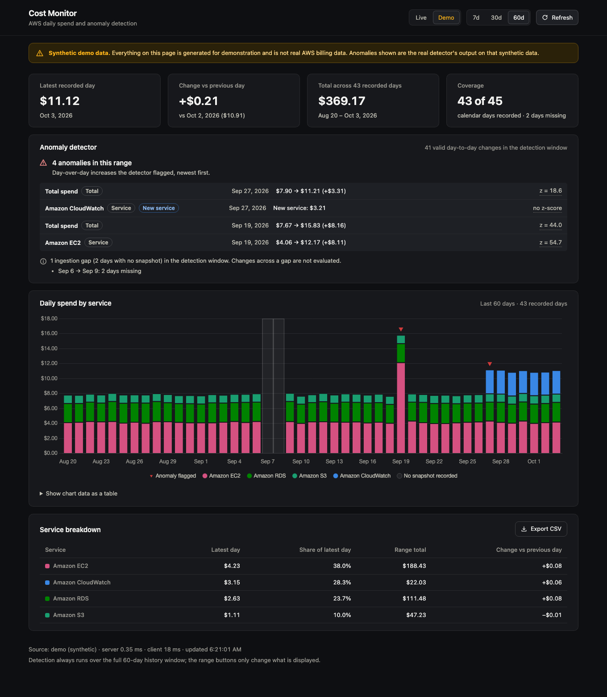

# 📊 Cost Monitor


AWS cost monitoring and anomaly-alerting system, built on real billing data pulled from the AWS Cost Explorer API. Detects day-over-day cost anomalies using a statistical method (not a guessed threshold), both in aggregate and per individual AWS service, and alerts by real email the moment a scheduled daily job finds something — running autonomously on AWS Lambda + EventBridge, not dependent on a laptop being on.

This is a monitoring and alerting tool — it does not claim or estimate cost savings. If a genuine optimization is ever found and fixed in the account it monitors, the before/after numbers would be documented here. Until then, every number below describes the system's own verified behavior — load times, a real confusion matrix, a real Lambda invocation, a real received email — not money saved, and not invented.

**Data provenance, stated plainly:** the monitored AWS account is on the free tier. Real Cost Explorer ingestion began on 2026-09-23, and real daily **net** spend as reported by Cost Explorer has been $0.00 or sub-cent on every day observed, far below the detector's $1.00 minimum-increase floor. "Net" matters: the pipeline does not filter out credits or refunds, and this account is funded by AWS credits, so these figures are after credits. They do not show that gross usage was zero (see Known limitations). There are therefore **no real anomalies** in this project's history, and every anomaly-detection result quoted here comes from synthetic, hand-constructed test data, labeled as such.

**Stored data as of 2026-10-04:** three synthetic fixture rows (2026-09-11 to 2026-09-13), written during early testing, were deleted from the table on 2026-10-04. The table now holds 11 consecutive real daily snapshots, 2026-09-23 through 2026-10-03, with no gaps. All values are net spend as reported by Cost Explorer (unfiltered, so including credits and refunds) and effectively $0. The only non-zero line item in the stored data is Amazon Simple Storage Service at about $0.0000000009 on 2026-10-03.

**Live detector status as of 2026-10-04:** the detector is active on live data (10 valid day-to-day changes, 5 of them evaluated) and has flagged nothing. Because every real value is about $0, this shows the pipeline running end to end on real data, **not** detection skill. Detection skill is shown only by the synthetic validation suites.

**Live demo:** https://cost-monitor-liard.vercel.app. Every number on that site is synthetic data, labeled as such on every view, and the real detector runs on it. Real-account (live) mode is not exposed publicly; it runs locally.

## Architecture

```
AWS Cost Explorer API
        │
        ▼
run_fetch.py (manual)   ─or─   AWS Lambda, daily via EventBridge
        │                       both call the same backend.pipeline.run_daily_pipeline()
        ▼
    DynamoDB  (one item per account_id + date)
        │
        ├──▶ backend.alerts (modified z-score: aggregate + per-service)
        │           │
        │           ▼
        │       AWS SNS ──▶ real email alert
        │
        ▼
   Flask API (/api/costs, /api/alerts, /api/detector-status, /api/cache-stats)
        │      ↕ in-memory TTL cache     (mode=demo: synthetic data, no AWS)
        ▼
  Dashboard (Chart.js)
```

## Features

- **Live billing data** — fetches real daily cost/usage data from AWS's [Cost Explorer API](https://docs.aws.amazon.com/aws-cost-management/latest/userguide/ce-what-is.html), grouped by service
- **Historical snapshots** — one snapshot per account per day in DynamoDB, with real ingestion starting 2026-09-23. Non-consecutive days (gaps in ingestion) are detected and excluded from the detector's statistics rather than allowed to corrupt them (see Challenges)
- **Statistical anomaly detection** — a modified z-score (median + median absolute deviation, robust to small-sample outliers in a way a plain mean/stddev z-score isn't) replaces a naive fixed-threshold check, evaluated both in aggregate and per individual AWS service, so a spike in one service isn't masked by a drop in another
- **Real email alerting** — a genuine AWS SNS subscription. Confirmed via an actual email received in an inbox, not just an API call returning success
- **Serverless daily automation** — AWS Lambda + EventBridge run the full ingest → detect → alert pipeline once a day, independent of whether any machine is powered on. The manual `run_fetch.py` path still exists for on-demand runs and shares the exact same underlying code
- **Interactive dashboard** — stacked bar chart of spend by service on a true calendar axis (a missing day shows as a gap, never as $0), anomaly markers, a detector panel that distinguishes "anomalies found" / "active, nothing unusual" / "warming up", ingestion-gap and stale-data notices, a service breakdown table, and CSV export. Vanilla JS + [Chart.js](https://www.chartjs.org/), served directly by Flask
- **Demo mode, clearly labeled synthetic** — `?mode=demo` serves a deterministic, generated 45-day dataset (one service spike, one new service, a 2-day ingestion gap) and runs the *real* detector on it, so the UI can be shown without AWS. Every demo API response carries `"synthetic": true`, and the page shows a persistent banner
- **In-memory caching** — short-TTL cache in front of DynamoDB reads, with real hit/miss tracking exposed via its own API endpoint
- **Live stats, everywhere** — dashboard load times, cache hit rate, a real synthetic confusion matrix, a real Lambda invocation's actual duration and memory use. Nothing in this project's numbers is invented

## Tech stack

| Layer | Tech |
|---|---|
| Backend | Python 3.14, Flask |
| Data source | AWS Cost Explorer API |
| Storage | DynamoDB (on-demand billing mode) |
| Anomaly detection | Modified z-score (median + MAD), pure Python (`statistics` module, no numpy) |
| Alerting | AWS SNS (email) |
| Automation | AWS Lambda + EventBridge (daily scheduled trigger) |
| IAM | Two non-root identities: a dedicated `cost-monitor-dev` IAM user for local runs (`setup_scoped_iam_user.py`) and a separate Lambda execution role (`setup_lambda_scheduler.py`), each with policies scoped to this project's named resources (see Security model) |
| Caching | In-memory TTL cache |
| Frontend | Server-rendered HTML/CSS/vanilla JS, Chart.js (CDN) |

Configured against a single AWS account: locally, whichever credentials `aws configure` points to (intended to be the scoped `cost-monitor-dev` user); on Lambda, the function's execution role. Cost Explorer provides daily-granularity billing data with a ~24–36 hour lag.

## Real metrics

Measured on this project, not estimated.

| Metric | Result |
|---|---|
| Full dashboard page load (client-measured, pre-caching) | 45–186ms across numerous real local reloads throughout the build |
| Cache-hit backend read time (`/api/costs` `meta.elapsed_ms`) | 0.0ms, confirmed via direct API response |
| Cache hit rate (early testing, small sample) | 33.3% (1 hit / 2 misses) |
| Anomaly detection — per-service synthetic suite (`test_service_validation.py`) | 8 multi-service scenarios, 164 judgments: 6 true positives, 1 false positive, 157 true negatives, 0 false negatives. Precision 0.857, recall 1.000, false positive rate 0.006. The false positive is a service's recovery back to normal the day after a one-day dip (see Known limitations) |
| Anomaly detection — aggregate synthetic validation suite | 3/3 true positives, 0 false positives, 0 false negatives, across 5 scenarios (38 total judgments). Precision 1.000, recall 1.000, false positive rate 0.000 |
| Anomaly detection — real account data | No real anomalies exist to detect: real daily net spend as reported by Cost Explorer (after credits) has been $0.00 or sub-cent since ingestion began on 2026-09-23, below the $1.00 minimum-increase floor. All anomaly-detection results in this README are synthetic |
| Real AWS cost data ingested | Daily since 2026-09-23 (Cost Explorer, grouped by service). Earlier rows that once appeared in the table (2026-09-11 to 2026-09-13) were synthetic fixtures written by `test_db.py`, not real billing data |
| AWS Lambda invocation, verified end-to-end | Duration 518.77ms (1398ms billed, including cold-start init), 102MB of 256MB memory used. Real CloudWatch Logs and a real DynamoDB write confirmed, not just a returned success code |
| SNS alert delivery | Confirmed: a real test alert was received in a real inbox, subject and body matching exactly what the code generates |

**Anomaly detection — synthetic validation suite, in detail:**
- Stable baseline, single real spike, organic multi-day growth (should *not* be flagged, even though each day individually clears the dollar floor), near-zero free-tier-style noise with one real jump, and a real missed-ingestion gap followed by a real anomaly 4 days later — all correctly handled
- This is explicitly synthetic, hand-constructed ground truth — not real production incidents. A clean result here means the method is *correct on these known cases*, not a claim that it will be perfect on arbitrary future real data
- On real account data the detector is active (as of 2026-10-04) and has flagged nothing, but every real value is about $0, so that is evidence the pipeline runs on real data, not evidence of detection skill

## Cost to run

The only part of this project with a per-call charge is the Cost Explorer API: **$0.01 per request** ([AWS Cost Explorer pricing](https://aws.amazon.com/aws-cost-management/aws-cost-explorer/pricing/)), and each paginated request counts as a request ([AWS docs](https://docs.aws.amazon.com/cost-management/latest/userguide/ce-what-is.html): "Each paginated API request incurs a charge of $0.01"). `backend/cost_fetcher.py` makes exactly one `GetCostAndUsage` call per pipeline run, so the daily schedule costs about **$0.30 per month**, plus $0.01 for each manual `run_fetch.py` run. That is covered by this account's AWS credits. The dashboard never calls Cost Explorer; it reads DynamoDB.

## Setup

**Requirements:** Python 3.10+ (tested on 3.14.7), an AWS account

```bash
git clone https://github.com/ttarkhani/cost-monitor.git
cd cost-monitor
python3 -m venv venv
source venv/bin/activate      # Windows: venv\Scripts\activate
pip install -r requirements.txt
```

**Create the scoped local IAM user (one time):**
```bash
python setup_scoped_iam_user.py
```
Run this once with credentials that are allowed to create IAM users, attach inline user policies and create access keys. It creates the `cost-monitor-dev` user (if missing), attaches the `cost-monitor-scoped-access` inline policy described under Security model, and, only if the user has no access key yet, creates one and prints the Access Key ID and Secret Access Key **once**. AWS will not show that secret again. If the user already has a key, the script does not create another.

**Configure AWS credentials** with that user's new key:
```bash
aws configure
```
All local commands below (`run_fetch.py`, the setup scripts, live mode in the dashboard) then run as `cost-monitor-dev`, not root.

**Enable Cost Explorer** (one-time, per AWS account): Billing and Cost Management → Cost Explorer → Enable. Can take up to 24 hours to finish indexing on a new account before it returns data.

**Create the table and pull a day of data:**
```bash
python setup_dynamodb.py
python run_fetch.py     # pulls yesterday's finalized costs — Cost Explorer has a ~24–36h billing lag
```

**Run the dashboard:**
```bash
python app.py
```
Open `http://127.0.0.1:5001` (the server binds to 127.0.0.1 only; set `COST_MONITOR_DEBUG=1` to enable Flask debug mode). Live mode reads DynamoDB and needs AWS credentials; **demo mode needs none**: open `http://127.0.0.1:5001/?mode=demo`, or use the Live / Demo toggle in the header. Everything shown in demo mode is synthetic and labeled as such.

**Run the offline tests** (no AWS access needed; credentials are blanked for the run):
```bash
./run_offline_tests.sh
```
This runs the aggregate and per-service synthetic validation suites, the pipeline tests (repeat-alert behavior, with AWS mocked), demo-data ground truth, detector status, the Flask API, the API contract check, the Lambda handler, and the dashboard's JS logic via `node --test` (Node 22 or newer, tested on 24; no npm packages). The same script runs in GitHub Actions on push and pull request. `test_db.py`, `test_alerts.py`, `test_alerting.py` and `test_cost_explorer.py` are *not* offline: they talk to real AWS.

**Enable real email alerts (optional):**
```bash
export ALERT_EMAIL=your_real_email@example.com
python setup_sns.py
```
Then check that inbox and click the confirmation link AWS sends — required before any alert will actually arrive. Verify with:
```bash
python test_alerting.py
```

**Automate with AWS Lambda + EventBridge (optional):**
```bash
mkdir -p lambda_package
cp lambda_handler.py lambda_package/
cp -r backend lambda_package/
rm -rf lambda_package/backend/__pycache__
cd lambda_package && zip -r ../lambda_deployment.zip . && cd ..
python setup_lambda_scheduler.py
```
This creates a dedicated, least-privilege IAM role (not root), packages and deploys the function, wires a daily EventBridge trigger, and immediately invokes it once for real to confirm it actually works end to end — rather than waiting a day to find out.

## Deployment

**The public deployment is demo-only.** It serves the synthetic demo dataset (clearly labeled, with the persistent banner) run through the real detector. It never shows live data. There is no public URL yet, and this setup has not been deployed yet.

**Why live mode is not deployed publicly:** live mode needs AWS credentials on the host and would expose this account's billing data to anyone with the URL. The real spend is about $0 anyway, so the demo is the more useful public view. A possible future option is Vercel's OIDC federation to a read-only IAM role (no long-lived keys on the host); it is not implemented. Live mode stays available locally (`python app.py`).

**How to deploy on Vercel:** import the repository in Vercel; no configuration is required.
- Vercel finds the Flask instance `app` in `app.py`.
- It installs `requirements.txt` and uses the Python version in `.python-version` (3.14).
- Static assets live in `public/static/`, which Vercel serves from its CDN at `/static/...`, the same URLs the local Flask server uses.
- `vercel.json` only trims the function bundle (tests, docs, setup and Lambda files are excluded).

**Environment variables:**

| Setting | Live mode |
|---|---|
| `COST_MONITOR_LIVE_ENABLED=1` | Enabled, anywhere |
| `COST_MONITOR_LIVE_ENABLED` set to anything else (e.g. `0`) | Disabled, anywhere |
| Not set, `VERCEL` set (Vercel's system variable) | Disabled |
| Not set, `VERCEL` not set (local) | Enabled |

When live mode is disabled:
- The page defaults to demo and has no Live toggle.
- `?mode=live` falls back to demo with a visible notice.
- Any `mode=live` API request returns HTTP 403 `{"error": "Live mode is disabled on this deployment. ..."}` before any AWS client is created.

Vercel documents `VERCEL` as an indicator that system environment variables are exposed to the deployment (a project setting). So also set `COST_MONITOR_LIVE_ENABLED=0` in the Vercel project, so the site stays demo-only even if that setting is off.

## Security model

Every statement below comes from the two setup scripts in this repo. No access key IDs, account IDs or ARNs appear here or in the code; ARNs are built at runtime from the caller's account.

| Identity | Created by | Used for |
|---|---|---|
| IAM user `cost-monitor-dev` | `setup_scoped_iam_user.py` | Local runs: `run_fetch.py`, the dashboard's live mode, and the one-time setup scripts |
| IAM role `cost-monitor-lambda-role` (trusted by `lambda.amazonaws.com` only) | `setup_lambda_scheduler.py` | The scheduled Lambda function |

The AWS root account has no access keys; neither path uses root.

**`cost-monitor-dev`: inline policy `cost-monitor-scoped-access`**
- Account-level (`Resource: "*"`): `ce:GetCostAndUsage` and `sts:GetCallerIdentity`.
- Only the `CostMonitorSnapshots` table: `dynamodb:CreateTable`, `DescribeTable`, `PutItem`, `Query`.
- Only the `cost-monitor-alerts` topic: `sns:CreateTopic`, `Publish`, `Subscribe`, `ListSubscriptionsByTopic`.
- One-time provisioning, each limited to one named resource:
  - only the `cost-monitor-lambda-role` role: `iam:CreateRole`, `GetRole`, `AttachRolePolicy`, `PutRolePolicy`;
  - only the `cost-monitor-daily-ingestion` function: `lambda:CreateFunction`, `UpdateFunctionCode`, `GetFunction`, `AddPermission`, `InvokeFunction`;
  - only the `cost-monitor-daily-trigger` rule: `events:PutRule`, `PutTargets`.
- `iam:PassRole` is limited to the single `cost-monitor-lambda-role`. An unscoped `iam:PassRole` next to `lambda:CreateFunction` is a well-known privilege-escalation pattern: it lets a user create a function that runs as *any* role in the account.

**`cost-monitor-lambda-role`**
- AWS managed policy `AWSLambdaBasicExecutionRole`, for CloudWatch Logs.
- Inline policy `cost-monitor-pipeline-permissions`:
  - `ce:GetCostAndUsage` and `sts:GetCallerIdentity` (account-level);
  - `dynamodb:PutItem`, `Query`, `DescribeTable` on the one table;
  - `sns:CreateTopic`, `Publish`, `ListSubscriptionsByTopic` on the one topic.

## API

| Endpoint | Description |
|---|---|
| `GET /` | Dashboard UI (server-rendered) |
| `GET /api/health` | Health check |
| `GET /api/costs` | Daily cost snapshots by service (live data cached for 60s) |
| `GET /api/alerts` | Detected day-over-day cost anomalies, aggregate and per-service |
| `GET /api/detector-status` | Baseline progress (`valid_transitions` of `required_baseline`), `state` (`warming_up` / `active`), ingestion gaps, latest snapshot date, and a `stale` flag |
| `GET /api/cache-stats` | Real cache hit/miss counts and hit rate |

`/api/costs`, `/api/alerts` and `/api/detector-status` accept:
- `mode=live|demo` (default `live`). `demo` never touches AWS.
- `days=1..60` (default 30): how many days to *display*. Detection always runs over the full 60-day window (`HISTORY_DAYS` in `backend/config.py`, shared with the daily pipeline), so a view never shows a day the detector did not see.

They respond with `{"data": ..., "meta": {...}, "synthetic": true|false}`; `meta` includes `source` (`cache`, `dynamodb` or `demo`) and `elapsed_ms`. Errors are JSON `{"error": "..."}` with a matching status: 400 for bad parameters, 503 when AWS is unreachable, 404/405/500 otherwise, with no stack traces. The payload shape is pinned by `tests/fixtures/api_demo_contract.json`, which both the Python and the JS tests check.

## Screenshots



*Demo mode: **synthetic data**, not real AWS billing. Captured with headless Chrome from the running app. The real account is free tier and its live view (net spend, after credits) is near-zero.*

## Challenges & how they were solved

- **Chart.js failed to load, no obvious clue at first glance** — the CDN URL pinned a version (`4.4.4`) that was never published to cdnjs, returning a silent 404. Root-caused via browser console (`Chart is not defined`) and confirmed the actual published versions directly from cdnjs's own listing before pinning to a real one (`4.4.1`).
- **Chart rendered at a different size on every reload** — Chart.js locks in an aspect ratio at creation time rather than a fixed pixel size, so small differences in when the container's width is measured produced visibly different proportions between loads. Fixed with a fixed-height wrapper and `maintainAspectRatio: false`.
- **`ModuleNotFoundError` running the ingestion script directly** — Python resolves imports relative to the directory a script runs from, not the project root. Fixed by keeping `backend/` as pure importable modules, with root-level entry points (`run_fetch.py`, `lambda_handler.py`) as the things actually meant to run.
- **A naive `mad == 0` check let floating-point noise through** — comparing a statistic to exact zero is unsafe: decimal subtraction (e.g. `6.30 - 5.00`) doesn't always land on a clean value, leaving a residual as small as `1e-15` instead of `0.0`. That residual slipped past the check and blew up a z-score calculation into astronomical, meaningless numbers. Fixed with an epsilon-based comparison — caught by actually running the synthetic validation suite, not by code review alone.
- **Fixing that bug revealed a second, hidden one** — the zero-variance fallback's own boundary check (`today_dev > max_dev`) had the identical float-comparison fragility, producing a real false positive on a scenario specifically designed to prove the method *doesn't* flag normal growth. Fixed by applying the same epsilon-buffer principle there too, then re-validating the full suite from zero to confirm both fixes actually held together.
- **A 10-day hole in the stored history would have silently corrupted the detector's baseline** — during development the stored history had a 10-day hole between two snapshots. The original code treated any two list-adjacent entries as one calendar day apart; a 10-day jump misread as a 1-day jump would skew every future statistical comparison. Fixed by parsing real calendar dates and excluding any non-consecutive-day transition from both evaluation and the historical baseline — while still surfacing it explicitly, not hiding it.
- **A freshly created Lambda function can't be invoked immediately** — `create_function` returns before AWS finishes provisioning the function, so an immediate `invoke()` call correctly throws `ResourceConflictException` with the function still `Pending`. Fixed using boto3's real `function_active_v2` / `function_updated_v2` waiters, which poll the function's actual live state rather than guessing at a fixed sleep duration.
- **A Lambda deployment package silently missing one file** — a packaging step ran before `backend/pipeline.py` existed, producing `Runtime.ImportModuleError: No module named 'backend.pipeline'` only once actually invoked in AWS. Diagnosed precisely from the zip's own file listing, not guesswork, and fixed with a clean rebuild.
- **The dashboard quietly fell out of sync with a backend change** — after the detection method switched from a percent-based threshold to a z-score, the frontend's alert renderer was never updated to match, still reading a field (`increase_pct`) that no longer existed on most anomaly records. Caught by a deliberate audit before it ever misfired live, and verified fixed by injecting a sample anomaly payload, in the exact shape the API returns, directly into the running dashboard's console.

## Known limitations

- The monitored account is free tier: real net spend as reported by Cost Explorer has been $0.00 or sub-cent on every day since real ingestion began on 2026-09-23. The detector has never seen a real anomaly, and all anomaly-detection validation in this project is synthetic.
- Stored figures are **net, not gross**. `cost_fetcher.py` calls `GetCostAndUsage` (`UnblendedCost`, grouped by service) with no `RECORD_TYPE` filter, so results include every charge type Cost Explorer reports. AWS lists those as including **Credit** and **Refund** ([charge types](https://docs.aws.amazon.com/cost-management/latest/userguide/ce-filtering.html); `RECORD_TYPE` in the [API reference](https://docs.aws.amazon.com/cli/latest/reference/ce/get-dimension-values.html)). On this credit-funded account, the numbers are after credits and do not show gross usage. The fetcher also keeps only services whose amount is above zero, so a service whose net amount is zero or negative is left out. Switching to gross figures (excluding credits and refunds) would make new rows incomparable with existing ones, creating a discontinuity in the stored history and in the detector's baseline.
- `cost_fetcher.py` does not follow `NextPageToken`. It reads only the first page of the `GetCostAndUsage` response, so if AWS ever split a day's response across pages ([API reference](https://docs.aws.amazon.com/aws-cost-management/latest/APIReference/API_GetCostAndUsage.html): the token is returned "when the response from a previous call has more results than the maximum page size"), the stored snapshot would be truncated: services missing and the total understated.
- Local and scheduled execution both run under non-root, purpose-built IAM identities, and the root account has no access keys (see Security model). The remaining gap: the day-to-day `cost-monitor-dev` user still holds the one-time provisioning permissions (IAM role creation and `iam:PassRole`, Lambda, EventBridge). Because it can rewrite `cost-monitor-lambda-role`'s policies (`iam:PutRolePolicy` / `iam:AttachRolePolicy`, with no limit on which policy) and update and invoke the function, it could widen that role's permissions and run code under it. A stricter setup would split provisioning into a separate identity, used only during setup, from the runtime identity used every day.
- Detection constants (`Z_THRESHOLD=3.5`, `MIN_WINDOW=5`, `MIN_ABS_INCREASE=$1.00`, `MAD_EPSILON=1e-6`) and cache TTL (60s) are hardcoded, not exposed as runtime config.
- The detection baseline is every valid consecutive-day change inside the 60-day `HISTORY_DAYS` window (shared by the pipeline and the dashboard), not a separately tuned rolling window.
- The pipeline emails only anomalies dated the day it just ingested, so an anomaly is alerted once rather than every day it stays in the window. Re-running the pipeline manually for the same date re-ingests that date and can re-alert for it.
- Cost Explorer data can change after the pipeline reads it: AWS documents that Cost Explorer "refreshes your cost data at least once every 24 hours" and that "some data might be updated later than 24 hours" ([AWS docs](https://docs.aws.amazon.com/cost-management/latest/userguide/ce-what-is.html)). The pipeline ingests each day once and never re-fetches it, so later revisions to a stored day are not picked up.
- Per-service detection has been validated only on synthetic data: precision 0.857, recall 1.000, false positive rate 0.006 across 8 scenarios (164 judgments, `test_service_validation.py`). The one false positive shows a real limitation: each increase is judged on its own, so when a service dips for one day and then returns to normal, its **recovery is flagged as a spike**.
- **Zero-variance windows can hide a repeat spike.** When all earlier day-to-day changes are identical, the median absolute deviation is zero and the detector falls back to flagging only an increase larger than every earlier deviation. In that mode, an earlier spike (and the drop after it) raises the bar, so a later spike of the same size is **missed**. Found while writing `test_pipeline.py` with a short repeating noise pattern; the detector (`backend/alerts.py`) is unchanged, and that test uses irregular noise.
- The unattended EventBridge trigger is supported by strong but indirect evidence. As of 2026-10-04, snapshots exist for every day from 2026-09-25 through 2026-10-02, although none were ingested by hand. The `ingested_at` stamps on two spot-checked rows (the 2026-09-26 row: `2026-09-27T13:00:07.632895`; the 2026-09-30 row: `2026-10-01T13:00:07.641187`) are both about 7.6 seconds after the 13:00 UTC schedule (`cron(0 13 * * ? *)` in `setup_lambda_scheduler.py`) and about 8.3 ms apart. `ingested_at` is written by `cost_fetcher.py` as `datetime.now().isoformat()`, a naive timestamp in the clock's local zone, which on Lambda is UTC. This is strong evidence the schedule fires unattended, but CloudWatch Logs and EventBridge metrics were not inspected, and only two of the eight rows were checked.
- Single AWS account only — no consolidated billing / multi-account support.
- Runs on Flask's built-in dev server, not a production WSGI server — this applies to the dashboard-viewing experience only; the actual scheduled ingestion pipeline runs on real AWS Lambda infrastructure, not Flask.
- Cache is in-memory and single-process — would need Redis to survive a restart or run across multiple processes.
- Cost Explorer's ~24–36h billing lag means the dashboard is never fully real-time.